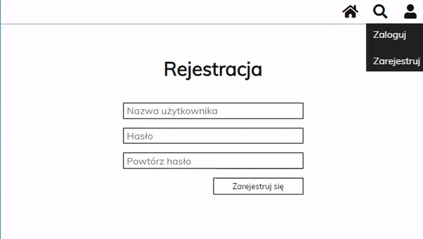
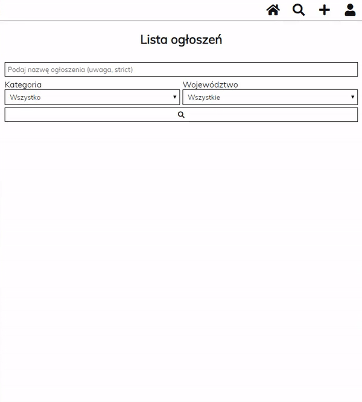
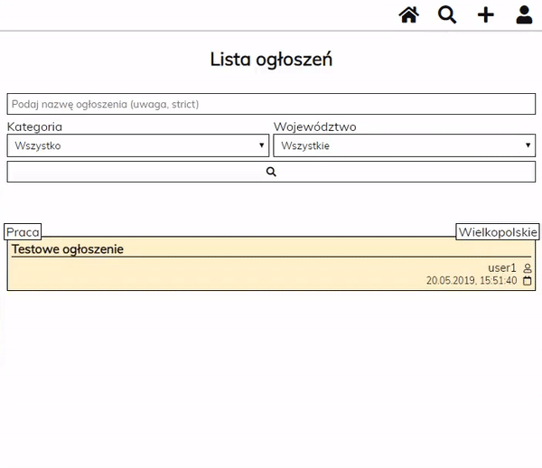

# Classifieds :newspaper:

A page that allows to view and add classifieds written in Vue using the backend written in Nodejs.

## Features
- Registration and login.
- Adding and deleting classifieds.
- Editing contact details.
- Searching and pagination.

## Technologies

- Vue (CLI 3)
- Axios
- NodeJs
- ExpressJs
- MongoDB
- Mongoose

## Use

### Registration

### Login
Login is possible after successful registration of the account.

Validation is on the **client** and **server** side.
After successful registration, a message will be displayed.
Passwords are hashed.

### Adding

### Deleting

### Editing contact details.
Contact details are displayed in every classifieds.

